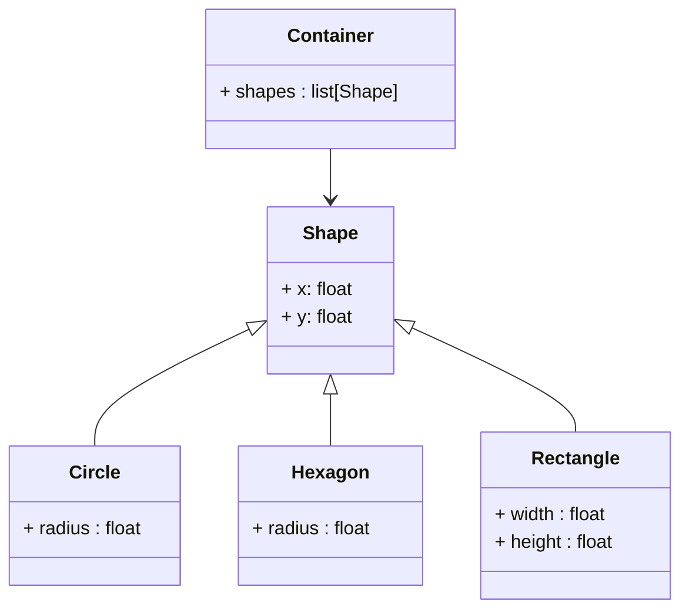

# pydantic-discriminator

Welcome to pydantic-discriminator! This is a small utility library that adds support for
discriminator-based polymorphism to [pydantic](https://pydantic-docs.helpmanual.io/).

> [!CAUTION]
> This library is **cursed** 💀 and was **condemned by the old ones**. I am trying to make it as safe as possible, but integrating this functionality into pydantic as an external library can be **very hacky** expecially after release 2. I warned you, proceed at your own risk.

> [!NOTE]
> Currently tested with 100% test coverage on every possible combination of:
> - Python 3.9, 3.10, 3.11 and 3.12
> - Pydantic 1.10, 2.0, 2.1, 2.3, 2.4, 2.5
> 
> Please fill this repository with issues if you find any bugs or have any suggestions.

## 📦Installation

You can install `pydantic-discriminator` with pip:

```bash
pip install pydantic-discriminator
```

The only requirement is [pydantic](https://pydantic-docs.helpmanual.io/), which is automatically installed with this library. No additional dependencies will be installed in your environment.

## 💡What does it do?

### 😡The problem

> [!IMPORTANT]
> The following example can be pretty long to read, but to some extent it is necessary to understand the problem that this library solves (or at least tries to solve).

Let's say you have a class hierarchy that looks like this:



Let's implement it with pydantic:

```python
class Shape(BaseModel):
    x: float
    y: float

class Circle(Shape):
    radius: float

class Hexagon(Shape):
    radius: float

class Rectangle(Shape):
    width: float
    height: float

class Container(BaseModel):
    shapes: list[Shape]
```

> [!CAUTION]
> The code above is **completely broken**. Nothing will work. Keep reading to find out why.


 
Now, let's write a program that uses this class hierarchy:

```python
my_data = {
    "shapes": [
        {"x": 0, "y": 0, "radius": 1},  # This is a Circle
        {"x": 1, "y": 2, "radius": 1},  # This is a Hexagon (because I said so)
        {"x": 5, "y": 3, "width": 1, "height": 1},  # This is a Rectangle
    ]
}

cont = Container.model_validate(my_data)
print(cont)
```
```
>>> shapes=[Shape(x=0.0, y=0.0), Shape(x=0.0, y=0.0)]
```

Disappointing, isn't it? We lost all the information about the shapes 😩. This is actually expected behaviour, because pydantic doesn't know that a `Shape` can be either a `Circle`, an `Hexagon` or a `Rectangle`. We just tell him that it is a list of `Shape`, and that's it, we get a list of `Shape`.

> [!WARNING]
> A very bad smell is coming from the fact that `Circle` and `Hexagon` have the same fields. Pydantic will never be able to tell them apart. This won't normally be a problem for any type system, like python's, but it is a problem for pydantic, because their serialization is ambiguous.

### 😕The "Union" solution

How should we handle this situation? As far as I know, we must sacrifice the Object-Oriented approach and use `Union` types. 

Let's rewrite our class hierarchy, applying the following changes:
- All classes have a `type` field that is used as a discriminator, and must be set to a hardcoded value, in the form of a string literal. They must all be different.
- In the `Container` class, replace the `Shape` hint with a `Union` hint that contains all the possible shapes.

```python
class Shape(BaseModel):
    type: Literal["shape"] = "shape"
    x: float
    y: float

class Circle(Shape):
    type: Literal["circle"] = "circle"
    radius: float

class Hexagon(Shape):
    type: Literal["hexagon"] = "hexagon"
    radius: float

class Rectangle(Shape):
    type: Literal["rectangle"] = "rectangle"
    width: float
    height: float

class Container(BaseModel):
    shapes: list[Circle | Hexagon | Rectangle]
```

Let's also update the client program:

```python
my_data = {
    "shapes": [
        {"type": "circle", "x": 0, "y": 0, "radius": 1},
        {"type": "hexagon", "x": 1, "y": 2, "radius": 1},
        {"type": "rectangle", "x": 5, "y": 3, "width": 1, "height": 1},
    ]
}

cont = Container.model_validate(my_data)
print(cont)
```
```
>>> shapes=[Circle(type='circle', x=0.0, y=0.0, radius=1.0), Hexagon(type='hexagon', x=1.0, y=2.0, radius=1.0), Rectangle(type='rectangle', x=5.0, y=3.0, width=1.0, height=1.0)]
```

It works! Yay! 🎉

But... something is not right.

> [!WARNING]
> What if a new class `Triangle` is added to the hierarchy? We must remember to add it to the `Union` type in `Container`. 

> [!CAUTION]
> What if we want to add the `Triangle` class to the hierarchy, but the `Container` class is defined in a different library? We can't, unless we do some radioactive monkey patching. ☢️ 

> [!WARNING]
> Moreover, the `Union` type is not very readable, and it will completely mess up every type hint in the `Container` class. The IDE will complain, the type checker will complain, and you will too. 😡

### The `pydantic-discriminator` solution

This library provides a solution to this problem by using a modified `BaseModel` class that can handle this situation. No more `Union` types, no more monkey patching, no more type checker errors.

> [!NOTE]
> All the pydantic features should be preserved. The new base class just adds some additional functionality.

Let's go back to the original class hierarchy, but applying the following changes:
- The `Shape` class is now a `DiscriminatedBaseModel` class.
- All classes have a class keyword argument `discriminator` that is used as a discriminator, and must be set to a hardcoded value, in the form of a string literal. They must all be different.

```python
from pydantic_discriminator import DiscriminatedBaseModel

class Shape(DiscriminatedBaseModel):
    x: float
    y: float

class Circle(Shape, discriminator="circle"):
    radius: float

class Hexagon(Shape, discriminator="hexagon"):
    radius: float

class Rectangle(Shape, discriminator="rectangle"):
    width: float
    height: float

class Container(BaseModel):
    shapes: list[Shape]
```
```
>>> shapes=[Circle(type_='circle', x=0.0, y=0.0, radius=1.0), Hexagon(type_='hexagon', x=1.0, y=2.0, radius=1.0), Rectangle(type_='rectangle', x=5.0, y=3.0, width=1.0, height=1.0)]
```

It works too! Yay! 🎉

> [!NOTE]
> The code is now much more clean and readable. It is basically the same as the original code, with the addition of the `discriminator` keyword argument.

> [!NOTE]
> Adding a new class to the hierarchy is now as easy as adding a new class to the hierarchy. No need to modify the `Container` class. The new class can also be located in different modules or libraries, as long as it is imported somewhere in the program and the `discriminator` keyword argument is set correctly.

> [!NOTE]
> The IDE and the type checker will be happy too. 😊

Under the hood, what happens is that the `DiscriminatedBaseModel` class will automatically add a `type_` (aliased to `type` to avoid potential conflicts with python keywords) field to the model, and whenever a model of the hierarchy is created, it will look for the correct class to instantiate among the registered subclasses, which is the one whose `discriminator` keyword argument matches the value of the `type_` field. 

Classes are registered automatically when they are defined in a tree structure, so there is no need to do anything else.